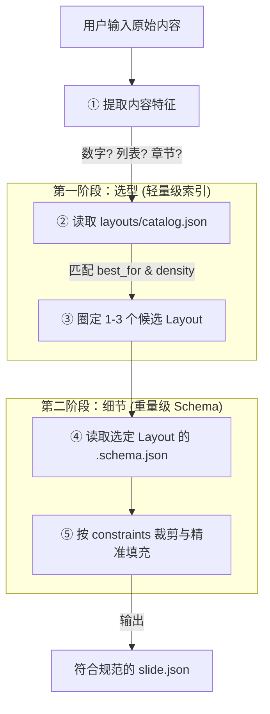

# wllbe (韦编) 系统架构规划设计 (V3.1)

## 1. 系统设计理念

本系统彻底摒弃了传统 PPT "固定版式+固定皮肤"的强绑定模式。核心目标是**极致的物理级解耦**。一个页面的呈现被拆解为六个独立且正交的维度：`Data`（数据）、`Layout`（布局）、`Master`（母版）、`Style`（风格）、`Palette`（色板）与 `Motion`（动效）。

所有资源**各司其职，共同为内容服务**。内容是核心输入，**布局（Layout）是承载内容的关键容器**。系统的威力来自于"数据驱动"与"海量布局库"的完美匹配。

---

## 2. 资源维度定义

### 2.1 Data (内容数据)
- **职能**：全系统的业务源，存储纯粹的信息（文字、图片路径、图表数据）。
- **产物**：`.json` 文件。
- **作用**：驱动布局填充，并通过 `meta` 字段声明所需的 Layout 与 Master。

### 2.2 Layout (布局容器)
- **职能**：定义内容的 DOM 结构与空间网格排布。
- **关键性**：系统的好用程度直接取决于 **Layout 库的丰富程度**。
- **规格**：使用 `data-field` 属性映射数据，预留 `l-master-anchor` 锚点。

### 2.3 Master (母版层)
- **职能**：控制页面的"环境氛围"与背景，提供全局统一的视觉基调。
- **产物**：独立的 HTML 背景片段，由引擎动态注入底层锚点。

### 2.4 Style (风格修饰)
- **职能**：对容器进行"视觉精装修"，定义材质、质感、边框及排版细节。
- **规范**：使用 `s-` 前缀，通过 Palette 变量上色。

### 2.5 Palette (色彩字典)
- **职能**：全局色彩令牌（Design Tokens）字典，确保色彩一致性。

### 2.6 Motion (动效系统)
动效作为渐进增强层，支持双轨独立控制：
- **Transitions (转场)**：页面间的空间切换感（Fade / Slide / Zoom / Flip / Convex）。
- **Animations (页内动效)**：页面元素的入场节奏（Smooth / Bouncy）。

---

## 3. 接口契约规范

### 3.1 Style Interface Contract (样式接口契约)

所有 Style 包**必须实现**以下最小类集合，否则切换 Style 时将出现"裸奔"：

| 类名 | 职责 | 使用场景 |
|------|------|---------|
| `.s-hero-title` | 封面主标题 | Cover 布局 |
| `.s-title` | 内页标题 | Content / Data 布局 |
| `.s-text-body` | 正文段落 | 全局 |
| `.s-card` | 内容卡片容器 | Grid / Bento / Timeline |
| `.s-highlight` | 强调文字 | 数据指标 / 标签 |
| `.s-slide-bg` | 幻灯片背景基底 | Master 背景层 |
| `.s-placeholder-box` | 占位区域 | 预设区块 |

> **规则**：Style 仅可修改视觉属性（颜色、圆角、投影、模糊），**严禁**覆盖元素的 Position、Width、Height、Display。

### 3.2 Layout Schema 规范

每个 Layout 必须配套一份 `[name].schema.json` 自描述文件，与 `.html` 同目录存放。Schema 承担两个职责：

1. **AI 选型依据**：通过 `identity` 和 `ai_guidance` 帮助 AI 判断该 Layout 是否适合用户的内容。
2. **内容适配约束**：通过 `fields` / `lists` 的 `constraints` 指导 AI 将内容裁剪为合适的长度和格式。

#### Schema 结构定义

```json
{
  "layout": "布局ID",
  "version": "1.0",

  "identity": {
    "name": "中文名称",
    "category": "分类代号",
    "description": "布局的自然语言描述，说明空间排布特点",
    "best_for": ["适用场景1", "适用场景2"],
    "not_for": ["不适用场景1"]
  },

  "capacity": {
    "content_density": "low | medium | high",
    "visual_weight": "title-dominant | balanced | number-dominant | ...",
    "text_volume": "minimal | moderate | rich"
  },

  "fields": {
    "字段名": {
      "type": "text | html | image",
      "required": true,
      "role": "字段的语义说明",
      "constraints": {
        "min_length": 0,
        "max_length": 100,
        "ideal_length": "推荐字符区间",
        "line_count": 1
      },
      "examples": ["示例值1", "示例值2"]
    }
  },

  "lists": {
    "列表名": {
      "required": true,
      "role": "列表的语义说明",
      "item_count": { "min": 2, "max": 5, "ideal": 3 },
      "item_fields": { "...同 fields 定义..." }
    }
  },

  "ai_guidance": {
    "selection_hint": "何时应选择此布局的判断提示",
    "content_adaptation": "如何将用户内容裁剪适配到此布局",
    "tone": "建议的文案风格"
  }
}
```

### 3.3 Motion 语义词汇表

以下为系统合法的 `data-motion` 取值。**所有 Animation Pack 必须完整实现**：

| 语义值 | 行为描述 |
|--------|---------|
| `fade-up` | 从下方淡入上移 |
| `fade-in` | 原地淡入 |
| `zoom-in` | 从缩小状态放大淡入 |
| `stagger-up` | 子元素依次交错上移入场 |

> 扩展新语义值时，需同步更新所有已有 Pack 的实现。

### 3.4 Master 结构契约

- 根元素必须包含 `absolute inset-0 -z-10` 确保置于底层。
- 可使用 Palette 变量（`var(--color-*)`) 以适配主题切换。
- 可包含纯装饰性动画（CSS 动画），但不可包含 GSAP 逻辑。
### 3.5 AI 驱动的内容编排流水线（两阶段决策模式）

为实现海量布局的高效检索，系统采用“两阶段决策”模式。AI 引擎不再直接扫描所有 Schema 文件，而是利用 `catalog.json` 建立的索引库进行分级决策。

#### 二级检索架构



1.  **第一阶段：全量快照选型 (Scanning)**
    *   AI 通过一次性读取 `catalog.json` 覆盖全平台资产。
    *   匹配 `identity.best_for`（场景语义）和 `capacity.content_density`（信息密度）。
    *   **目标**：选出最合适的“容器 ID”。

2.  **第二阶段：精准协议适配 (Filling)**
    *   AI 只针对选中的容器 ID 读取其完整的 `.schema.json` 契约文档。
    *   严格遵守 `constraints`（最大字数、理想项数）进行文案编辑。
    *   **目标**：生成完全合规的业务数据（Data）。

---

## 4. Layout 分类体系 (Taxonomy)

| 类型 | 代号 | 用途 | 现有示例 |
|------|------|------|---------|
| 封面型 | `cover` | 开场 / 结尾 / 章节分隔 | `cover.html` |
| 内容型 | `content` | 文字段落为主的展示 | `split.html` |
| 数据型 | `data` | 数据指标、图表可视化 | `stats.html` |
| 复合型 | `composite` | 多区块错落布局 | `bento.html` |
| 流程型 | `flow` | 时间线、流程步骤 | `timeline.html` |
| 网格型 | `grid` | 等分卡片矩阵 | `grid.html` |
| 媒体型 | `media` | 图片 / 视频为主导 | *(待扩展)* |

> 每个 Layout 文件应在 HTML 注释中声明其所属分类。

---

## 5. 系统集成与编排引擎

### 5.1 Manifest (全局配置)

系统通过 `manifest.json` 声明式配置启动，引擎不硬编码任何业务假设：

```json
{
  "title": "演示标题",
  "defaults": {
    "palette": "./palettes/dark-pro.css",
    "style": "./styles/glassmorphism.css",
    "master": "tech",
    "transition": "fade",
    "animation": "smooth"
  },
  "canvas": { "width": 960, "height": 540, "unit": "px" },
  "slides": [
    { "data": "slide-1.json" },
    { "data": "slide-2.json", "master": "default" }
  ]
}
```

### 5.2 渲染流水线

1. **读取 Manifest**：获取全局配置与幻灯片列表。
2. **获取数据 (Data)**：按声明顺序逐一加载 JSON。
3. **匹配容器 (Layout)**：根据 JSON `meta.layout` 从布局库拉取 HTML。
4. **注入环境 (Master)**：按优先级（slide 级 > JSON 级 > manifest 级）加载母版。
5. **绑定填充**：将 JSON `content` 自动映射到 Layout 的 `data-field` 锚点。
6. **激活视觉**：挂载 Style / Palette / Motion。

### 5.3 画布规格

画布尺寸通过 CSS 变量 `--slide-width` / `--slide-height` 定义，支持在 manifest 中按需配置：

| 比例 | 尺寸 | 适用场景 |
|------|------|---------|
| 16:9 | 960 × 540 | 演示（默认） |
| 4:3 | 960 × 720 | 传统幻灯片 |
| 9:16 | 540 × 960 | 竖版 / 移动端 |
| 1:1 | 720 × 720 | 社交媒体 |

---

## 6. 资源库目录结构

```text
/wllbe-project
  ├── manifest.json            # 全局配置（单一真相源）
  ├── /data/                   # 业务内容数据
  ├── /layouts/                # 布局库（系统好用程度的关键）
  │   ├── layout-core.css      # 画布基础约束
  │   ├── cover.html           # Layout 结构文件
  │   ├── cover.schema.json    # Layout 自描述 Schema（AI 决策依据）
  │   ├── grid.html
  │   ├── grid.schema.json
  │   └── ...
  ├── /masters/                # 母版背景库
  ├── /styles/                 # 视觉设计包
  ├── /palettes/               # 色彩变量定义
  ├── /motions/                # 动效逻辑包
  │   ├── /transitions/        # 页间转场库
  │   └── /animations/         # 页内动画包
  └── index.html               # 组装引擎
```

---

## 7. 开发规范与架构底线

1. **内容驱动**：Layout HTML 中**严禁**包含任何业务文案，一切通过 `data-field` 注入。
2. **Tailwind 隔离原则**：
   - ✅ 允许：`flex`, `grid`, `gap`, `p-*`, `m-*`, `w-*`, `h-*`, `items-*`, `justify-*`, `relative`, `z-*`
   - ❌ 禁止：`bg-*`, `text-*`(颜色), `shadow-*`, `rounded-*`, `border-*`(颜色), `opacity-*`
3. **Style 必须可替换**：任何 Style 都必须实现完整的 Interface Contract（§3.1）。
4. **Motion 独立性**：动画绝不可影响内容的可读性。关闭所有动画后，内容必须 100% 可视。
5. **Master 底层化**：母版永远处于 `-z-10`，不干扰内容层的点击与交互。
6. **Manifest 驱动**：引擎不硬编码页数、默认主题或画布尺寸，一切从 `manifest.json` 读取。

---

## 8. 降级策略

| 场景 | 策略 |
|------|------|
| **无 JavaScript** | Layout 保持语义化 HTML 结构，裸 DOM 下内容仍可阅读 |
| **动效关闭** | 所有 `data-motion` 元素的最终帧必须是静止可视状态 |
| **打印** | 通过 `@media print` 隐藏控制面板，强制显示所有页面为纵向排列 |
| **离线导出** | 支持将所有资源内联为单一 HTML 文件，确保无网络环境下可用 |
