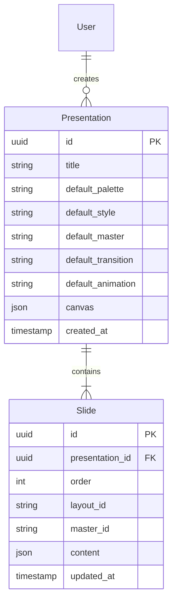

# wllbe (韦编) 系统技术架构方案 V2.1

> 本文档是 wllbe 在线平台的工程蓝图，与 `wllbe_system_design.md` (V3.1) 的六维解耦规范严格对齐。

---

## 1. 总体设计原则

将"内容、布局、风格、色板、母版、动效"的极致解耦理念平台化。系统是一个**端到端的、数据驱动的内容资产编排与分发平台**。

### 1.1 架构约束

- **Manifest 驱动**：在线版的每一份演示文稿（Presentation）本质上是一个持久化的 Manifest，引擎不硬编码任何业务假设。
- **资产即插件**：Layout / Style / Master / Palette / Motion Pack 都是可注册、可热插拔的独立资产。
- **渐进增强**：协同编辑、AI 生成等高阶功能作为可选增强层，不影响核心渲染链。

---

## 2. 技术栈选型

### 2.1 创作引擎 (Frontend)

| 层次 | 选型 | 职责边界 |
|------|------|---------|
| 框架 | **Next.js 14+ (App Router)** | SSG 分享页 / CSR 编辑器 / API Routes |
| 类型系统 | **TypeScript** | 全栈类型安全，Schema 与 Registry 强类型化 |
| 样式 | **Tailwind CSS** | Layout 结构原子类 + Palette CSS 变量注入 |
| 页面转场 | **Framer Motion** | 声明式 React 页间 Transition 动画 |
| 页内动效 | **GSAP** | 命令式页内元素入场时序编排 |

> **双引擎分工规则**：Framer Motion **仅**负责 Transition（页面切换），GSAP **仅**负责 Animation（页内元素入场）。两者不得操作同一元素的同一属性，以避免竞态冲突。

### 2.2 存储与后台 (Backend)

| 层次 | 选型 | 理由 |
|------|------|------|
| 数据库 | **Supabase (PostgreSQL)** | 关系模型适配 Presentation → Slide 的层级结构，内置 Auth + Storage |
| 文件存储 | **Supabase Storage / S3** | 存放用户上传的图片、自定义母版等二进制资产 |
| 认证 | **Supabase Auth** | 开箱即用的社交登录 + JWT |

> **MVP 阶段不引入 Headless CMS**。Layout / Style / Master 等系统级资产通过 **Asset Registry（文件系统 + Git）** 管理。当需要"资产商店"或"多租户"时再评估 CMS 引入时机。

### 2.3 导出与渲染 (Rendering Service)

| 能力 | 选型 | 机制 |
|------|------|------|
| PDF 导出 | **Puppeteer（Headless Chrome）** | 利用系统"动效可关闭"特性，渲染静态 HTML 后逐页截图 |
| HTML 导出 | **资源内联打包脚本** | 将所有 CSS / JS / 图片 base64 编码为单一 HTML 文件 |
| 图片导出 | **Puppeteer + Sharp** | 截图后裁剪优化 |

### 2.4 协同编辑 (渐进增强，P3 阶段)

| 选型 | 理由 |
|------|------|
| **Yjs (CRDTs)** | 无冲突实时同步，适合 JSON 文档的并发编辑 |
| **Liveblocks** | 作为备选的托管方案，降低自建 WebSocket 的运维成本 |

---

## 3. 数据模型

### 3.1 核心实体关系



### 3.2 资产与内容的关系

```
Presentation 1 ──── N Slide
Slide N ──── 1 Layout      (从 Registry 引用)
Slide N ──── 1 Master      (可覆盖 Presentation 默认值)
Presentation 1 ──── 1 Palette   (全局默认色板)
Presentation 1 ──── 1 Style     (全局默认风格)
```

**关键设计决策**：

- **Slide.content** 存储为 JSON 字段，对应 System Design V3.1 的 Data 维度。
- **Layout / Style / Master / Palette** 是全局共享的系统资产，以 ID 引用而非嵌入。
- 每个 Slide 可覆盖 Presentation 级别的 Master（per-slide override），与 Demo 中 Manifest 的优先级链一致。

---

## 4. 资产注册表 (Asset Registry)

这是连接六维解耦系统与 Next.js 前端的桥梁。

### 4.1 注册表结构

```typescript
// /lib/registry/layouts.ts
import { z } from 'zod';

/**
 * LayoutSummary (Catalog 索引项)
 * 用于列表展示与 AI 选型阶段，追求极致轻量。
 */
export interface LayoutSummary {
  id: string;
  name: string;
  category: 'cover' | 'content' | 'data' | 'composite' | 'flow' | 'grid' | 'media';
  content_density: 'low' | 'medium' | 'high';
  best_for: string[];
  visual_weight: string;
  thumbnail: string;
}

/**
 * LayoutDefinition (布局全量定义)
 * 用于渲染阶段与 AI 填充阶段。
 */
export interface LayoutDefinition extends LayoutSummary {
  schema: z.ZodType;           // Zod Schema 校验内容字段
  component: React.FC<Props>;  // React 渲染组件
}

export const LayoutRegistry: Record<string, LayoutDefinition> = {
  cover:    { id: 'cover',    category: 'cover',     ... },
  // ... 其他布局详见 catalog.json 与各自 .schema.json
};
```

### 4.2 Style / Master / Palette / Motion 注册表

采用相同模式：

```typescript
// /lib/registry/styles.ts
export const StyleRegistry: Record<string, StyleDefinition> = {
  glassmorphism:  { id: 'glassmorphism',  name: '毛玻璃',   css: '/styles/glassmorphism.css' },
  'minimal-flat': { id: 'minimal-flat',   name: '扁平简约', css: '/styles/minimal-flat.css' },
};

// /lib/registry/masters.ts
export const MasterRegistry: Record<string, MasterDefinition> = {
  default: { id: 'default', name: '留白',     component: DefaultMaster },
  tech:    { id: 'tech',    name: '科技网格', component: TechMaster },
};
```

### 4.3 六维资产在 Next.js 中的存储形态

| 资产维度 | 存储位置 | 形态 | 加载方式 |
|---------|---------|------|---------|
| **Layout** | `/components/layouts/` | React 组件 | 静态 import → Registry |
| **Style** | `/public/styles/` | CSS 文件 | 运行时 `<link>` 热切换 |
| **Palette** | `/public/palettes/` | CSS 变量文件 | 运行时 `<link>` 热切换 |
| **Master** | `/components/masters/` | React 组件 | 静态 import → Registry |
| **Motion (Transition)** | `/lib/motions/transitions/` | Framer Motion variants | 静态 import |
| **Motion (Animation)** | `/lib/motions/animations/` | GSAP Timeline 工厂 | 静态 import |
| **Data (Content)** | Supabase `slides.content` | JSON 字段 | API Route 查询 |

---

## 5. 渲染模式策略

Next.js App Router 提供了多种渲染模式，wllbe 在不同场景下选择最优模式：

| 场景 | 路由 | 渲染模式 | 理由 |
|------|------|---------|------|
| 公开分享链接 | `/p/[id]` | **SSG + ISR** | 内容固定后静态化，极速加载；ISR 支持内容更新后自动重建 |
| 编辑器工作台 | `/editor/[id]` | **CSR** | 大量交互（拖拽、实时预览），无需 SEO |
| PDF 导出预览 | `/export/[id]` | **SSR** | 需要完整 HTML 供 Puppeteer 捕获 |
| 资产商城/浏览 | `/gallery` | **SSG** | 公开内容，SEO 友好 |

---

## 6. API 设计骨架

### 6.1 核心资源 API

| 端点 | 方法 | 职责 |
|------|------|------|
| `/api/presentations` | GET / POST | 演示文稿列表查询与创建 |
| `/api/presentations/[id]` | GET / PATCH / DELETE | 单份演示文稿的读取、更新、删除 |
| `/api/presentations/[id]/slides` | GET / POST | 获取幻灯片列表、新增幻灯片 |
| `/api/presentations/[id]/slides/[slideId]` | PATCH / DELETE | 单页幻灯片的内容更新与删除 |
| `/api/presentations/[id]/slides/reorder` | POST | 幻灯片排序 |

### 6.2 资产查询 API

| 端点 | 方法 | 职责 |
|------|------|------|
| `/api/registry/layouts` | GET | **选型检索**：获取所有 Layout 的精简快照 (catalog.json) |
| `/api/registry/layouts/[id]` | GET | **协议详情**：获取特定 Layout 的完整 Schema 与约束 |
| `/api/registry/styles` | GET | 获取所有可用 Style 列表 |
| `/api/registry/masters` | GET | 获取所有可用 Master 列表 |
| `/api/registry/palettes` | GET | 获取所有可用 Palette 列表 |
| `/api/registry/motions` | GET | 获取所有可用 Motion Pack 列表 |

### 6.3 导出 API

| 端点 | 方法 | 职责 |
|------|------|------|
| `/api/export/[id]/pdf` | POST | 触发 PDF 导出任务 |
| `/api/export/[id]/html` | POST | 触发单文件 HTML 内联打包 |
| `/api/export/[id]/images` | POST | 触发全页截图导出 |

---

## 7. 系统分层架构

### 7.1 前端分层

```text
┌─────────────────────────────────────────────────┐
│                   UI Layer                       │
│  ┌──────────┐  ┌──────────┐  ┌───────────────┐  │
│  │ 分享页面  │  │ 编辑工作台 │  │ 资产浏览画廊  │  │
│  │ /p/[id]  │  │ /editor  │  │  /gallery     │  │
│  └──────────┘  └──────────┘  └───────────────┘  │
├─────────────────────────────────────────────────┤
│              Orchestration Layer                  │
│  ┌──────────────────────────────────────────┐    │
│  │  Rendering Pipeline (渲染流水线)          │    │
│  │  Manifest → Data → Layout → Master →     │    │
│  │  Style Context → Motion Engine           │    │
│  └──────────────────────────────────────────┘    │
├─────────────────────────────────────────────────┤
│              Asset Layer (六维资产)               │
│  ┌────────┐ ┌───────┐ ┌────────┐ ┌──────────┐  │
│  │ Layout │ │ Style │ │ Master │ │ Palette  │  │
│  │Registry│ │Registry│ │Registry│ │ Registry │  │
│  └────────┘ └───────┘ └────────┘ └──────────┘  │
│  ┌──────────────────────────────────────────┐    │
│  │          Motion Registry                  │    │
│  │  Transitions (Framer) + Animations (GSAP) │    │
│  └──────────────────────────────────────────┘    │
├─────────────────────────────────────────────────┤
│              Data Layer                          │
│  ┌──────────────┐  ┌───────────────────────┐    │
│  │  Supabase DB  │  │  Supabase Storage     │    │
│  │  (Postgres)   │  │  (Images / Assets)    │    │
│  └──────────────┘  └───────────────────────┘    │
└─────────────────────────────────────────────────┘
```

### 7.2 编辑器工作台设计

编辑器作为 CSR 单页应用，采用**三面板布局**：

```text
┌─────────────────────────────────────────────────────────┐
│  顶部工具栏 (Header)：文件操作 / 导出 / 分享 / 全屏预览     │
├──────┬───────────────────────────────┬──────────────────┤
│ [◄]  │                               │ [►]              │
│      │        中央画布区域 (Canvas)    │ ┌──────────────┐ │
│ 幻灯 │        (所见即所得)          │ │ 当前属性 [▲] │ │
│ 片列 │                               │ ├──────────────┤ │
│ 表   │        ┌─────────────┐        │ │ 全局风格 [▲] │ │
│      │        │  Slide 1    │        │ ├──────────────┤ │
│ [可  │        └─────────────┘        │ │              │ │
│ 折   │                               │ │  AI Copilot  │ │
│ 叠]  │   ┌─────────────────────┐     │ │  (弹性伸缩)   │ │
│      │   │ 状态栏 [1/6 | 100%]  │     │ │              │ │
│      │   └─────────────────────┘     │ └──────────────┘ │
└──────┴───────────────────────────────┴──────────────────┘
```

#### 弹性 UI 功能清单：

- **左侧侧边栏 (Side Rail)**：
    - 支持一键折叠（Foldable）。折叠后仅显示细长的缩略边条或完全隐藏，为画布腾出水平空间。
- **中央画布 (Canvas)**：
    - **居中平衡**：画布始终在剩余空间内水平/垂直居中。
    - **精简状态栏**：状态栏悬浮在画布下方中央，不再横跨全屏，仅显示页码、比例等核心元数据。
- **右侧双轨面板**：
    - **全局折叠**：支持水平隐藏。
    - **垂直弹性 (Vertical Flex)**：
        - **属性面板**：支持上下折叠。当用户需要专注于 AI 对话时，可将属性表单收起。
        - **AI Copilot**：占据剩余的所有垂直高度。支持全高模式（Full Height），打造深度对话环境。
- **响应式交互**：
    - 采用 **CSS Grid + Resizable Handles**，允许用户手动拉伸面板宽度或调整 AI 区的高度分配。

确保系统设计的每条规范在技术架构中都有落地方案：

| V3.1 规范 | 技术落点 |
|-----------|---------|
| **Manifest 驱动** | Presentation 记录 = 持久化的 Manifest；API Route 提供读写 |
| **Style Interface Contract** | Zod Schema 在构建期校验 Style CSS 文件是否包含全部必需类 |
| **Layout Schema** | 每个 Layout 配套 Schema 声明，通过 Zod 驱动编辑器 UI 生成与 AI 填充 |
| **两阶段 AI 决策** | API 分离 `/layouts` (索引) 与 `/[id]` (详情)，支持快速扫描选型 |
| **Motion 语义词汇表** | `MotionRegistry` 枚举所有合法 `data-motion` 值，Pack 注册时校验完整性 |
| **Master 结构契约** | Master 组件的 `props` 接口强制 `className` 包含 `-z-10`，TypeScript 编译期保障 |
| **画布规格可配** | CSS 变量 `--slide-width/height` 由 Presentation.canvas 字段驱动 |
| **降级：无 JS** | SSG 输出语义化 HTML，`<noscript>` 提示增强功能需 JS |
| **降级：打印** | `/public/print.css` 全局 `@media print` 隐藏 UI，线性排列所有幻灯片 |
| **降级：离线导出** | `/api/export/[id]/html` 触发资源内联打包为单文件 |

---

## 9. 项目推进路线图

| 阶段 | 里程碑 | 交付物 | 预估周期 |
|------|--------|--------|---------|
| **P0.1** | 项目脚手架 | Next.js + TypeScript + Tailwind + Supabase 初始化 | 1 天 |
| **P0.2** | 引擎迁移 | Demo 的 `app` 对象 → React Hooks + Context | 2-3 天 |
| **P0.3** | Asset Registry | Layout / Style / Master / Palette 注册表 + 动态加载 | 2 天 |
| **P0.4** | 分享页面 | `/p/[id]` SSG 渲染，支持公开访问 | 1 天 |
| **P1.1** | 数据持久化 | Supabase 集成，Presentation / Slide CRUD API | 2 天 |
| **P1.2** | 编辑器骨架 | 三面板布局，Layout 选择 + JSON 内容编辑 | 3-5 天 |
| **P1.3** | 视觉控制器 | Palette / Style / Master 实时预览切换 | 2 天 |
| **P2.1** | 导出服务 | Puppeteer PDF + 单文件 HTML 导出 | 2-3 天 |
| **P2.2** | 布局库扩展 | 新增 10+ 个 Layout 组件，覆盖全部 7 种分类 | 持续 |
| **P3.1** | 用户系统 | Supabase Auth 集成，我的演示文稿 | 1-2 天 |
| **P3.2** | 协同编辑 | Yjs 集成（仅在产品验证通过后启动） | 评估后定 |

---

## 10. 技术风险与缓解

| 风险 | 等级 | 缓解策略 |
|------|------|---------|
| Framer Motion + GSAP 竞态 | 🔴 高 | 严格划分作用域：FM 管 Transition，GSAP 管 Animation，不操作同一元素 |
| Layout 库不够丰富 | 🟡 中 | P2.2 持续扩展；建立 Layout 开发模板与 CLI 工具降低贡献门槛 |
| Tailwind CDN → 构建 | 🟡 中 | Demo 使用 CDN 版，Next.js 迁移时切换为 PostCSS 构建版 |
| Supabase 冷启动延迟 | 🟢 低 | 分享页使用 SSG 规避后端延迟；编辑器使用乐观更新 |
